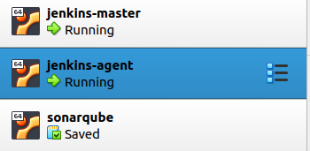
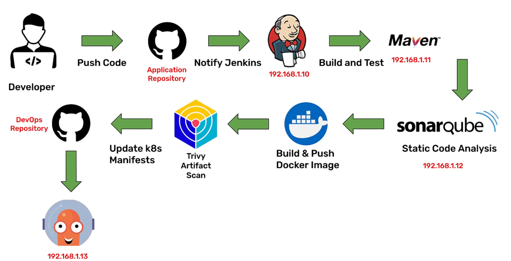
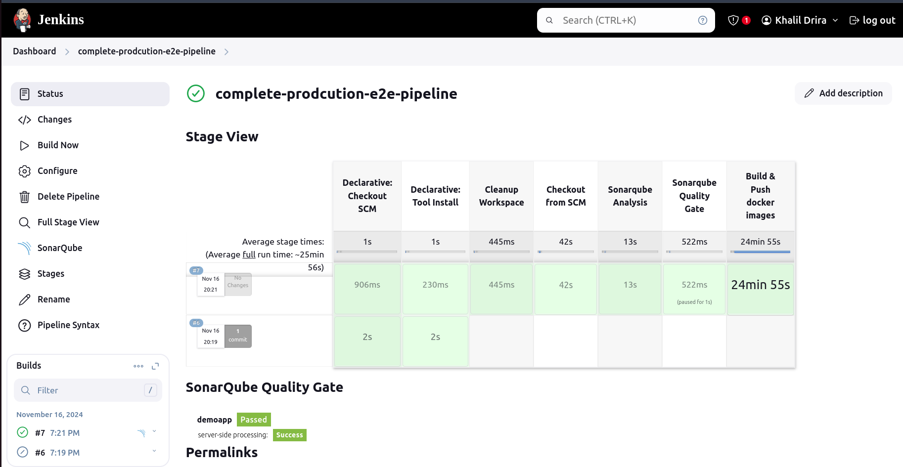
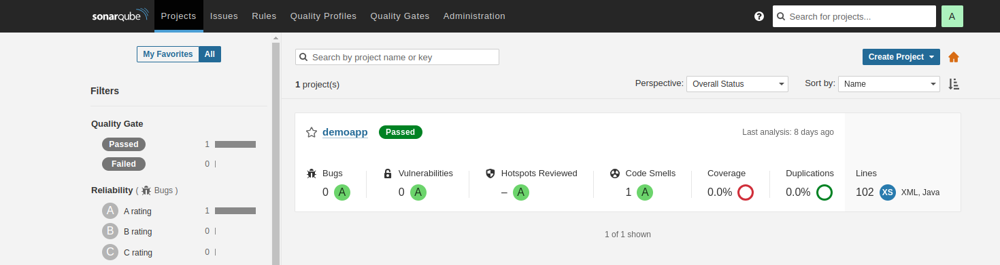

# Kubernetes CI Pipeline Using Jenkins for DevOps

## Overview

This project demonstrates the implementation of a **Kubernetes CI pipeline** using Jenkins. The pipeline automates various stages of software development, including building, testing, static code analysis, Docker image creation, and artifact scanning. 

The primary goal is to establish a robust CI (Continuous Integration) process that ensures high-quality, production-ready applications by leveraging tools like Jenkins, SonarQube, Docker, and Trivy.

---

## Objectives

1. Automate the CI pipeline for application development.
2. Use distributed builds to optimize performance with Jenkins Master-Agent architecture.
3. Perform static code analysis and ensure quality gates using SonarQube.
4. Build and push Docker images to a registry for containerized deployments.
5. Integrate artifact scanning to enhance security.
6. Lay the foundation for future Continuous Deployment (CD) pipelines.

---

## Pipeline Steps

### Step 1: Push Code
- Developers push their code to the **GitHub Application Repository**.
- A webhook triggers Jenkins to initiate the pipeline.

### Step 2: Build and Test
- Jenkins runs the build process using **Maven** (on `192.168.1.11`).
- Tests are executed to validate the code.

### Step 3: Static Code Analysis
- **SonarQube** (on `192.168.1.102`) performs static code analysis.
- The pipeline ensures the code meets quality standards and passes SonarQube’s quality gates.

### Step 4: Docker Image Creation
- Docker images are built using the application source code.
- The images are pushed to the Docker registry for future deployment.

### Step 5: Artifact Scanning
- **Trivy** scans the Docker images for vulnerabilities to ensure secure deployment.

### Step 6: Kubernetes Manifest Updates
- The pipeline updates Kubernetes deployment manifests in the **DevOps Repository**.
- These manifests point to the latest Docker image tags.

---

## Architecture

The pipeline uses a **Jenkins Master-Agent** architecture:
- **Jenkins Master**: Orchestrates the pipeline and handles UI (`192.168.1.100`).
- **Jenkins Agent**: Executes the actual build and test tasks in a distributed environment.

---

## Tools Used

- **Jenkins**: Central CI tool for orchestrating the pipeline.
- **Maven**: Handles application building and testing.
- **SonarQube**: Ensures code quality and security through static analysis.
- **Docker**: Creates containerized application builds.
- **Trivy**: Scans artifacts for vulnerabilities.
- **GitHub**: Hosts the application and Kubernetes manifest repositories.

### Pipeline Flow Diagram

---

## Results

### Jenkins Pipeline
- Successfully implemented all CI pipeline stages.
- Results are visible in the Jenkins dashboard.

### SonarQube Quality Gate
- Passed all quality gates with no bugs, vulnerabilities, or critical code smells.

---

## Future Steps: Continuous Deployment (CD)

1. **ArgoCD Integration**:
   - Automate deployments using GitOps principles.
   - Ensure seamless updates of Kubernetes clusters with new Docker images.

2. **Monitoring**:
   - Incorporate tools like Prometheus and Grafana for monitoring CI/CD performance and application health.

3. **TLS Setup**:
   - Secure Jenkins, SonarQube, and other tools with TLS encryption.

4. **Advanced Deployments**:
   - Implement canary or blue-green deployment strategies for minimal downtime.

---

## How to Run the CI Pipeline

1. Clone this repository and navigate to the folder.
2. Configure Jenkins Master and Agent nodes as described.
3. Install and configure SonarQube for static analysis.
4. Trigger the Jenkins pipeline to see the CI stages in action.

---
